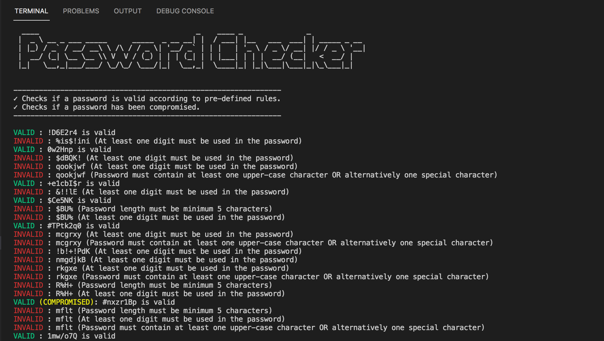

# Password Checker App

## Overview

This is a solution to Erasys trial task for back-end developers

This project is structured into two parts:

- `api`
  - an endpoint to check the validity of a password according to preset rules
- `cli`
  - a CLI script for reading password records from a database and validating each of them via the api developed above and also with the provided endpoint for checking compromised passwords.

The password rules for the `api` are stored in a separate json file located in `config/PasswordRules.json`. This file consits of the rules with the key being the regex pattern and the value being the corresponding error message. Furthermore, the MySQL connection settings for the CLI script is located in a separate file `ormconfig.js` in `cli` folder

## Tech Stack

- NodeJS
- Typescript
- Express (for the api)
- MySQL (using TypeORM)

## Setup:

- Clone the project: `git clone https://gitlab.com/atunje_afolabi/erasys-backend-trial-task-nodejs.git`
- `api`
  - `cd` into the `api` folder
  - Run `npm install` to install dependencies
  - Run `npm run dev` to start local server
- `cli`
  - Create a database named `testdb`
  - Load the `sqldump.sql` into the database
  - `cd` into the `cli` folder
  - Run `npm install`

## Usage

To run the CLI script:

- Run `npm run dev` from the `cli` folder

### Screenshots

##### The CLI



## Running Test:

- `api`
  - Run `npm run test`
- `cli`
  - Create a separate database named `test-database`
  - Create a table with:
  ```sql
  CREATE TABLE passwords ( password VARCHAR(20) NOT NULL, valid INT NULL DEFAULT NULL, PRIMARY KEY (password) ) ENGINE=InnoDB DEFAULT CHARSET=utf8;
  ```
  - Run `npm run test`

## Future Work

- Improve user interface of the CLI
- Add more tests
- Add database migration for automaic table creation during testing
- Further refactoring of the codebase

## Issues

- For any issue, kindly create a new [issue](https://gitlab.com/atunje_afolabi/erasys-backend-trial-task-nodejs/-/issues).

Thank You!
